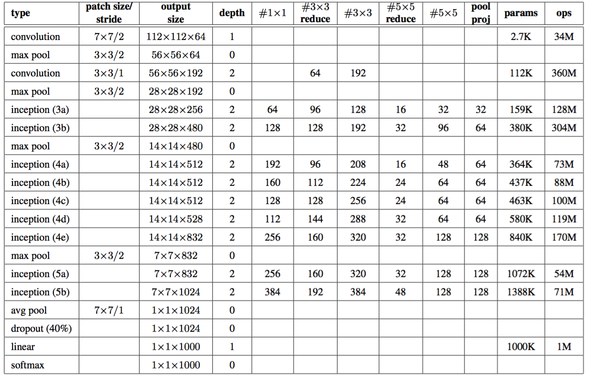

# googLeNet
here is my implementation of the basic googLeNet described in the paper [Going Deeper with Convolutions](http://www.cv-foundation.org/openaccess/content_cvpr_2015/html/Szegedy_Going_Deeper_With_2015_CVPR_paper.html) in keras

I wrapped the inception module described in the paper and put it in the file "inceptionModel.py"

the structure of the net is described as following:

### MODIFIED:

#### googleNet_add_deep.py:

following inception block 5, add an extra inception block named with 6

max pool(3\*3/2)  7\*7\*1024 

inception_6a 	7\*7\*1024  384 192 384 48 128 128

inception_6b		7\*7\*1408  512 256 512 48 192 192

avgpool(7\*7/1)	1\*1\*1408

#### googleNet_pool.py:

add an extra pooling layer in the last avg pooling layer

avgpool(7\*7/1)	2\*2\*1024

avgpool(2\*2/1)	1\*1\*1024